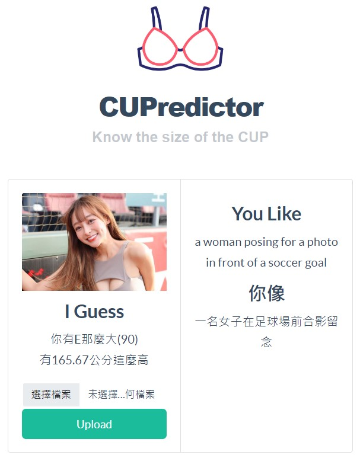

# CUPredictor - Know the size of the BRA
<div align="center">
 <p>Upload image and you will get a description</p>
 
</div>

## Base Model
```Python=
image-to-text: Salesforce/blip-image-captioning-base
image regression: ResNet in Pytorch
```

## Usage
Clone this repo. 
```
git clone https://github.com/TedYeh/CUPredictor.git
```

Run the `main.py` to build the flask platform.
```
python main.py
```

Choose the photo you want to predict, and the model will give the result.

## Train metrics
See detail at `predictor.py`
```Python=
Model: ResNet50 (Pretrain=True)
Optimizer: AdamW (Learning Rate: 8e-4) 6 Epoch
Task: Binary Classification and Regression
Data: 2,058 photo stickers (see ./image dir)
```
